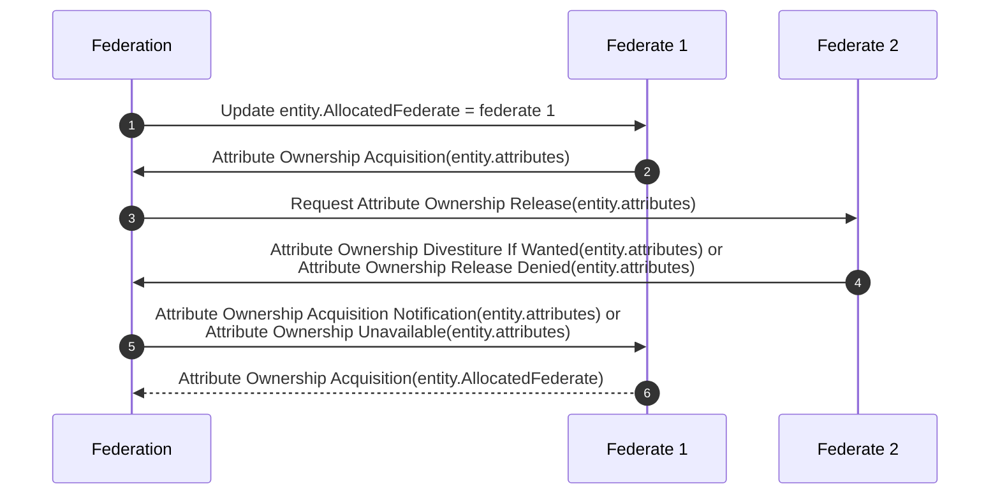
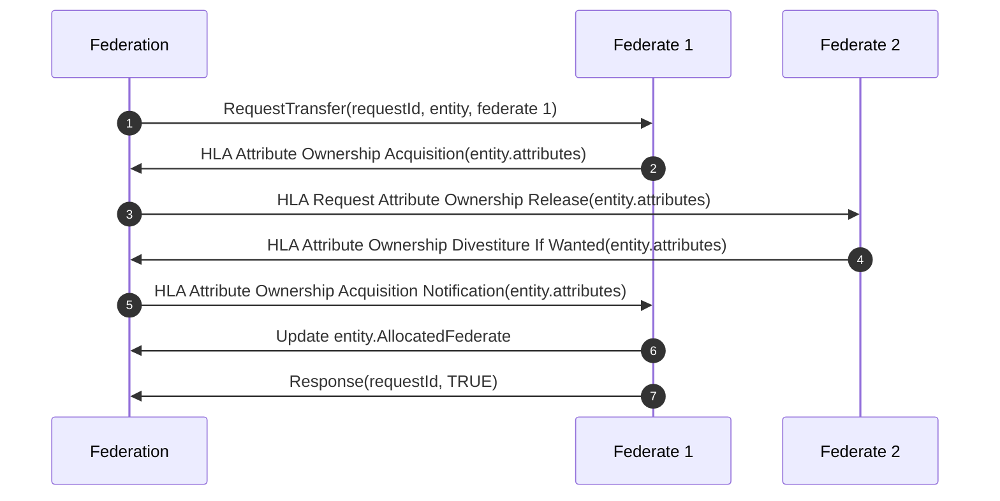
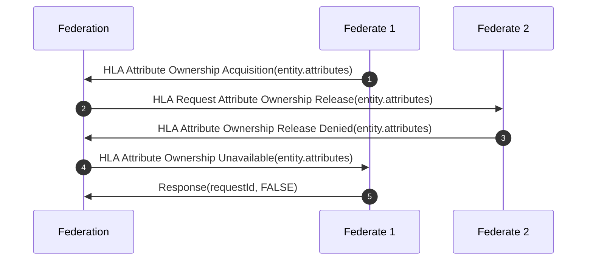
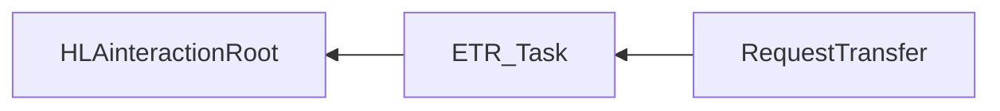

# NETN-TMR
|Version| Date| Dependencies|
|---|---|---|
|3.0|2023-11-15|NETN-BASE, NETN-ORG, NETN-ETR|

The NATO Education and Training Network Transfer of Modelling Responsibilities (NETN-TMR) FOM module provides a standard interface and pattern for transferring modelling responsibility between federates. It extends the HLA Ownership Management services by providing the means to request a modelling responsibility transfer and to publish the assigned modelling responsibilities of object instances.
        
For example:
            
* Transfer modelling responsibility between virtual and constructive simulation systems  
* Transfer modelling responsibility between high- and low-fidelity models  
* Transfer modelling responsibility to allow backup, maintenance or load-balancing

In a federated distributed simulation, the participating systems (federates) collectively model the synthetic environment. Allocation of modelling responsibilities depends on individual federate capabilities, federation design agreements, and initial scenario conditions. The primary responsibility for modelling a simulated entity is allocated to, at most, one federate. However, during execution, the modelling responsibility and ownership of individual attributes may change. 

NETN-TMR covers the following cases:            
* Initialization with assigned modelling responsibilities for objects 
* Explicit request to transfer modelling responsibility 
* Triggering of modelling responsibility transfer by updating the allocation of responsibility attribute

## Overview 

NETN-TMR extends the HLA concept of object instance attribute ownership by associating primary modelling responsibility to objects in the federation. Only one federate has the primary modelling responsibility, but the responsibility can be transferred. Primary responsibility does not require ownership (HLA ownership) of all attributes of an object.

The federate with a primary responsibility shall respond to all related NETN-ETR `ETR_Task` requests.

The NETN-TMR modules defines the optional attribute `AllocatedFederate` as an extension to the `HLAobjectRoot` object class. The value of the `AllocatedFederate` attribute refers to a federate by its unique name.

* The owner (HLA ownership) of the `AllocatedFederate` attribute is the federate with primary modelling responsibility for the object.
* An update of this attribute triggers the referenced federate to initiate a transfer to acquire primary modelling responsibility.
* Sending a `RequestTransfer` interaction triggers the referenced federate to initiate a transfer. If successful, the acquiring federate owns (HLA owenership) the `AllocatedFederate` attribute and updates its value to the federate name.
* Transfer of primary modelling responsibility is impossible if the `AllocatedFederate` attribute is unowned in the federation.
 
### AllocatedFederate attribute update
 
An update of the `AllocatedFederate` attribute triggers the referenced federate to acquire the primary modelling responsibility. E.g. during scenario initialization, a federate may register all objects and then update the `AllocatedFederate` attributes to trigger a change in modelling responsibility.



 
1. The `AllocatedFederate` attribute update triggers the referenced federate (Federate 1) to start the acquisition of primary modelling responsibility. 
2. Use the HLA service `Attribute Ownership Acquisition` to request ownership of relevant attributes.
3. The federate currently owning a requested attribute (Federate 2) receives a `Request Attribute Ownership Release` callback. 
4. Release the attribute using the `Attribute Ownership Divestiture If Wanted` HLA service, or if unable to release, use the `HLA Attribute Ownership Release Denied`. 
5. The HLA callback `Attribute Ownership Acquisition Notification` indicates a successful attribute ownership transfer, and the `Attribute Ownership Unavailable` callback indicates an unsuccessful transfer. 
6. Acquire the ownership of the `AllocatedFederate` attribute to complete the transfer of modelling responsibility.


### RequestTransfer Interaction 
 
Sending a `RequestTransfer` triggers the referenced federate to start acquiring modelling responsibility. 
 
#### Successful RequestTransfer 

 
1. Send a `RequestTransfer` interaction with reference to the entity and the acquiring federate (Federate 1). 
2. If required, use the HLA service `Attribute Ownership Acquisition` to request ownership of relevant attributes for the referenced entities. 
3. The federate currently owning a requested attribute (Federate 2) receives a `Request Attribute Ownership Release` callback. 
4.  Release the attribute using the `Attribute Ownership Divestiture If Wanted` HLA service. 
5. The HLA callback `Attribute Ownership Acquisition Notification` indicates a successful attribute ownership transfer. 
6. After a successful transfer, update the `FederateApplication` attribute of the transferred entities to reference the new federate application that received the modelling responsibility. 
7. Send a `Response` interaction indicating the successful completion of the request. 
 
#### Unsuccessful Transfer 

If a ownership release of a required attribute is denied, the transfer is cancelled and the acquiring federate shall update the `AllocatedFederate` attribute to represent the federate with primary modelling responsibility. 


 

1. Use the HLA service `Attribute Ownership Acquisition` to request ownership of relevant attributes for the referenced entities. 
2. The federate currently owning a requested attribute (Federate 2) receives a `Request Attribute Ownership Release` callback.
3. Deny the attribute release using the `Attribute Ownership Release Denied` HLA service.
4. The HLA callback `Attribute Ownership Release Denied` indicates an unsuccessful attribute ownership transfer.
5. Cancel the transfer and send a `Response` interaction indicating failed.


## Object Classes

Note that inherited and dependency attributes are not included in the description of object classes.

```mermaid
graph RL
```

### HLAobjectRoot


|Attribute|Datatype|Semantics|
|---|---|---|
|AllocatedFederate|FederateName|Optional. Reference to the federate application with the assigned primary responsibility for modelling the object behaviour.|

## Interaction Classes

Note that inherited and dependency parameters are not included in the description of interaction classes.



### RequestTransfer

Trigger a transfer of modelling responsibility for the specified entity.

|Parameter|Datatype|Semantics|
|---|---|---|
|Federate|FederateName|Required: Reference to the federate requested to acquire modelling responsibility of the simulation entity.|
