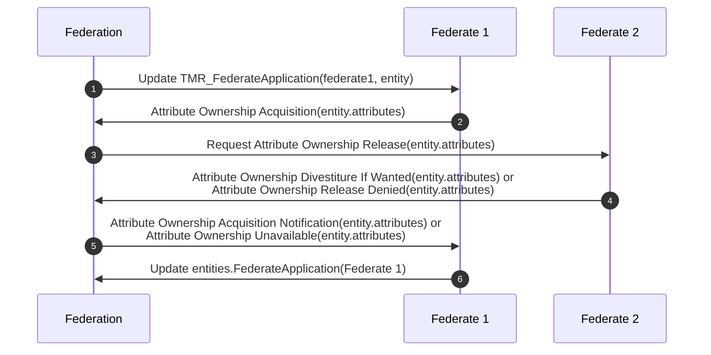
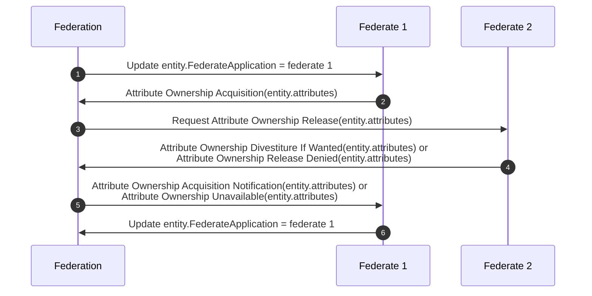
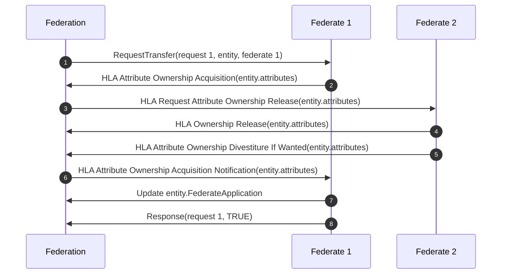
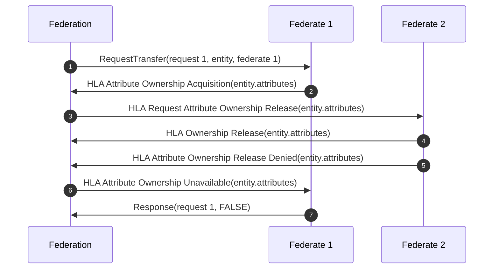
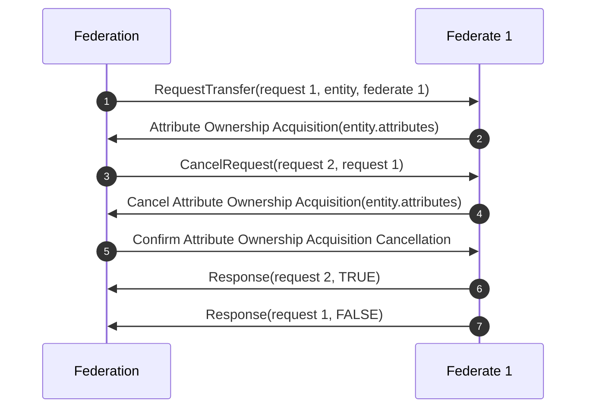
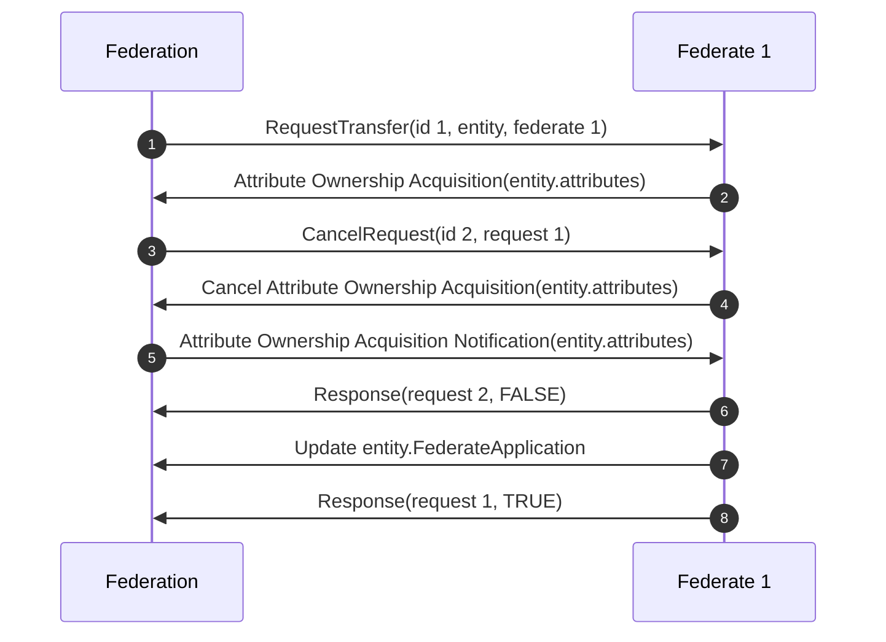
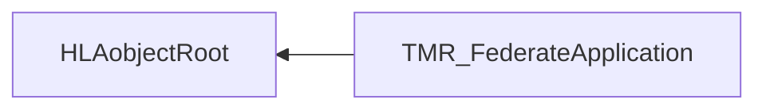
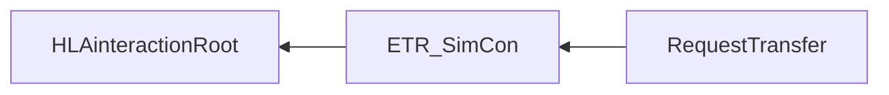

# NETN-TMR
|Version| Date| Dependencies|
|---|---|---|
|3.0|2023-10-29|NETN-BASE, NETN-ORG, NETN-ETR|

The NATO Education and Training Network Transfer of Modelling Responsibilities (NETN-TMR) FOM module provides a standard interface and protocol for transferring modelling responsibility between federates. It extends the HLA Ownership Management services by providing the means to Request a Transfer of Modelling Responsibility and to publish the initial and current modelling responsibilities. Use this capability to, for example:
            
* Transfer modelling responsibility between virtual and constructive simulation systems  
* Transfer modelling responsibility between hign- and low-fidelity models  
* Transfer modelling responsibility to allow backup, maintenance or load-balancing

In a federated distributed simulation, the participating systems (federates) collectively model the synthetic environment. Allocation of modelling responsibilities depends on individual federate capabilities, federation design agreements, and initial scenario conditions. The primary responsibility for modelling a simulated entity is allocated to, at most, one federate. However, during execution, the modelling responsibility and ownership of individual attributes may change. 

The NETN-TMR FOM module is based on IEEE 1516 High Level Architecture (HLA) Object Model Template (OMT) and supports interoperability in a federated simulation (federation) based on HLA. A Federation Object Model (FOM) Module specifies how data is represented and exchanged in the federation. The NETN-TMR FOM module is available as an XML file for use in HLA-based federations.

NETN-TMR covers the following cases:            
* Initialization with assigned modelling responsibilities for units, installations and equipment to specific federate applications 
* Explicit request for transfer of modelling responsibility 
* Implicit triggering of transfer of modelling responsibility by updating the allocation of responsibility

## Overview 

A Federate Application is software that can join as a federate to one or more federations, e.g. an instance of a simulation joining a federation using HLA services or a bridging tool joining multiple federations. The NETN-TMR requires all federate applications participating in transferring modelling responsibilities to be identified using a UUID. Federation agreements should include a list of pre-defined unique identifiers for each participating federate application.

The NETN-TMR FOM module uses the `TMR_FederateApplication` object class to publish federate application-specific data for allocating modelling responsibilities. The `UniqueId` attribute of the `TMR_FederateApplication` object class matches the UUID of the federate application.

The NETN-TMR FOM also extends the `HLAobjectRoot` object class with the optional attribute `FederateApplication`. This attribute references a federate application which should have the modelling responsibility of the entity. The value of this attribute is updated when a federate application receives modelling responsibility but can also be updated to trigger a transfer of modelling responsibility. 
    
Transfer of modelling responsibilities between federate applications is triggered using one of the following patterns:
- Implicit by updating attributes of a `TMR_FederateApplication` object instance related to a federate application.
- Implicit by updating the FederateApplication attribute of a simulation entity.
- Explicit by sending the `RequestTransfer` interaction to request a federate application to initiate the transfer of modelling responsibility.
 
The NETN-TMR also defines the optional `HLAinteractionRoot` parameter `FederateApplication`. The primary purpose of this parameter is to tag all interactions with sender information. This approach allows better logging of interactions for analysis and debugging. 

 
### Implicit TMR using TMR_FederateApplication object

The `TMR_FederateApplication` object class represents modelling responsibility for NETN-ORG units, installations and equipment. Any change of the `TMR_FederateApplication` attributes is an implicit TMR trigger for the referenced federate application to, if required, take the modelling responsibility.

1. A `TMR_FederateApplication` object instance with a `UniqueId` corresponding to Federate 1 is updated to indicate which Unit, Installation and Equipment entities the federate should have modelling responsibility for.
2. If required, Federate 1 uses the HLA service `Attribute Ownership Acquisition` to request ownership of relevant attributes for the referenced entities.
3. The federate currently owning a requested attribute (Federate 2) receives a `Request Attribute Ownership Release` callback.
4. Release the attribute using the `Attribute Ownership Divestiture If Wanted` HLA service, or if unable to release, use the `HLA Attribute Ownership Release Denied`.
5. The HLA callback `Attribute Ownership Acquisition Notification` indicates a successful attribute ownership transfer, and the `Attribute Ownership Unavailable` callback indicates an unsuccessful transfer.
6. After a successful transfer, update the `FederateApplication` attribute of the transferred entities to reference the new federate application that received the modelling responsibility.

### Implicit TMR using FederateApplication attribute

An update of the `FederateApplication` attribute of a simulated entity is an implicit TMR trigger for the referenced federate application to, if required, take the modelling responsibility. E.g. during scenario initialization, a federate may register all objects and then update the `FederateApplication` attributes to trigger a change in modelling responsibility. Another example is using a log/replay tool to instantiate all objects at a specific time and then allow the modelling responsibility to be transferred to other federate applications to continue the simulation execution.

1. A `FederateApplication` attribute of an HLA object instance is updated to indicate to the referenced federate (Federate 1) to start the transfer of modelling responsibility.
2. If required, Federate 1 uses the HLA service `Attribute Ownership Acquisition` to request ownership of relevant attributes for the referenced entities.
3. The federate currently owning a requested attribute (Federate 2) receives a `Request Attribute Ownership Release` callback.
4. Release the attribute using the `Attribute Ownership Divestiture If Wanted` HLA service, or if unable to release, use the `HLA Attribute Ownership Release Denied`.
5. The HLA callback `Attribute Ownership Acquisition Notification` indicates a successful attribute ownership transfer, and the `Attribute Ownership Unavailable` callback indicates an unsuccessful transfer.
6. After a successful transfer, update the `FederateApplication` attribute of the transferred entities to reference the new federate application that received the modelling responsibility.

### Explicit TMR using Request Transfer

This pattern uses NETN-ETR SimCon Request-Response interactions and the NETN-TMR `RequestTransfer` interaction. Sending a `RequestTransfer` triggers a federate application to start acquiring modelling responsibility. Use the NETN-ETR `CancelRequest` to attempt cancellation of the `RequestTransfer`. 

#### Successful RequestTransfer

 
1. Send a `RequestTransfer` interaction with a reference to the entity and the acquiring federate (federate 1).
2. If required, Federate 1 uses the HLA service `Attribute Ownership Acquisition` to request ownership of relevant attributes for the referenced entities.
3. The federate currently owning a requested attribute (Federate 2) receives a `Request Attribute Ownership Release` callback.
4.  Release the attribute using the `Attribute Ownership Divestiture If Wanted` HLA service.
5. The HLA callback `Attribute Ownership Acquisition Notification` indicates a successful attribute ownership transfer.
6. After a successful transfer, update the `FederateApplication` attribute of the transferred entities to reference the new federate application that received the modelling responsibility.
7. Send a `Response` interaction indicating the successful completion of the request.

#### Unsuccessful RequestTransfer

1. Send a `RequestTransfer` interaction with a reference to the entity and the acquiring federate (federate 1).
2. If required, Federate 1 uses the HLA service `Attribute Ownership Acquisition` to request ownership of relevant attributes for the referenced entities.
3. The federate currently owning a requested attribute (Federate 2) receives a `Request Attribute Ownership Release` callback.
4. Deny the attribute release using the `Attribute Ownership Release Denied` HLA service.
5. The HLA callback `Attribute Ownership Release Denied` indicates an unsuccessful attribute ownership transfer.
6. Send a `Response` interaction indicating the failure to complete the request.

 
#### Successful Cancellation of RequestTransfer
 
Send a `CancelRequest` interaction to attempt to cancel a request for transfer of modelling responsibility.

 
1. Send a `RequestTransfer` interaction with a reference to the entity and the acquiring federate (federate 1).
2. If required, Federate 1 uses the HLA service `Attribute Ownership Acquisition` to request ownership of relevant attributes for the referenced entities.
3. Send a `CancelRequest` (request 2) interaction referencing the original `RequestTransfer` interaction (request 1).
4. If Federate 1 has already started acquiring ownership of attributes using HLA services, then use the `Cancel Attribute Ownership Acquisition` HLA service to attempt cancellation of the acquisition. 
5. The HLA callback `Confirm Attribute Ownership Acquisition Cancellation` indicates a successful cancellation.
6. Send a `Response` interaction referencing the `CancelRequest` (request 2) and indicating a successful cancellation.
7. Send a `Response` interaction referencing the `RequestTransfer` (request 1) and indicating an unsuccessful transfer.

#### Unsuccessful Cancel RequestTransfer

1. Send a `RequestTransfer` interaction with a reference to the entity and the acquiring federate (federate 1).
2. If required, Federate 1 uses the HLA service `Attribute Ownership Acquisition` to request ownership of relevant attributes for the referenced entities.
3. Send a `CancelRequest` (request 2) interaction referencing the original `RequestTransfer` interaction (request 1).
4. If Federate 1 has already started acquiring ownership of attributes using HLA services, then use the `Cancel Attribute Ownership Acquisition` HLA service to attempt cancellation of the acquisition.
5. The HLA callback `Attribute Ownership Acquisition Notification` indicates an unsuccessful cancellation and that the transfer of attribute ownership is complete.
6. Send a `Response` interaction referencing the `CancelRequest` (request 2) and indicating unsuccessful cancellation.
7. Update the `FederateApplication` attribute of the transferred entities to reference the new federate application that received the modelling responsibility.
8. Send a `Response` interaction referencing the `RequestTransfer` (request 1) and indicating a successful transfer.

## Object Classes

Note that inherited and dependency attributes are not included in the description of object classes.

### HLAobjectRoot

|Attribute|Datatype|Semantics|
|---|---|---|
|FederateApplication|UUID|Optional. Reference to the federate application with the primary responsibility for modelling the object behaviour. The attribute value shall correspond to the UniqueId of a FederateApplication.|

### TMR_FederateApplication

The TMR_FederateApplication object class represents the allocation of modelling responsibility of units, installations and equipment items. Updates of these attributes may trigger the federate application to request a change in modelling responsibility.

|Attribute|Datatype|Semantics|
|---|---|---|
|Units|ArrayOfUuid|Optional. The units for which the federate has the responsibility of simulating.  The default is an empty list.|
|Equipment|ArrayOfUuid|Optional. The equipment for which the federate has the responsibility of simulating.  The default is an empty list.|
|Installations|ArrayOfUuid|Optional. The installations for which the federate has the responsibility of simulating. The default is an empty list.|

## Interaction Classes

Note that inherited and dependency parameters are not included in the description of interaction classes.

### HLAinteractionRoot

|Parameter|Datatype|Semantics|
|---|---|---|
|FederateApplication|UUID|Optional. Reference to the federate application sending this interaction.|

### RequestTransfer

|Parameter|Datatype|Semantics|
|---|---|---|
|NewFederateApplication|UUID|Required: Reference to the federate application requested to acquire modelling responsibility of the simulation entity.|
