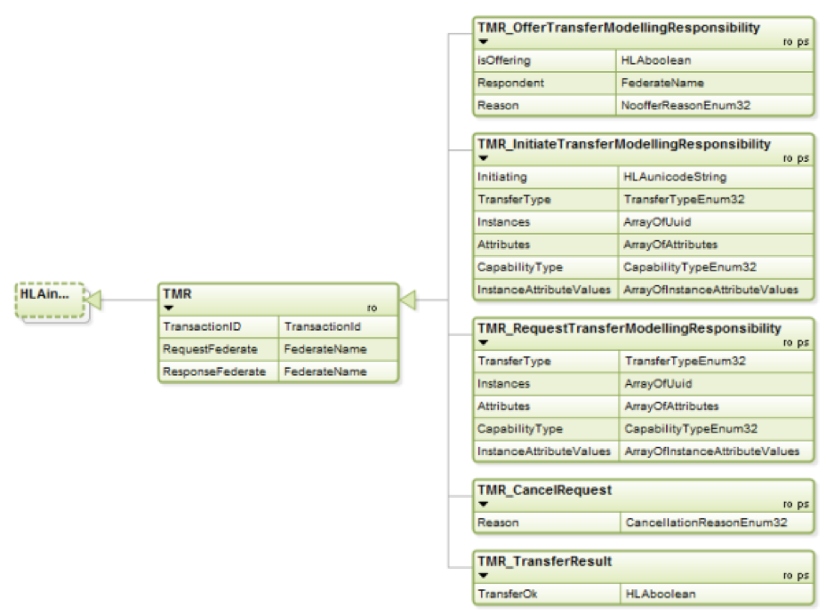
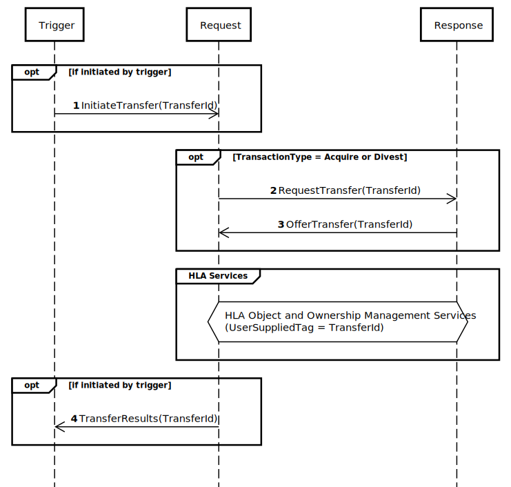
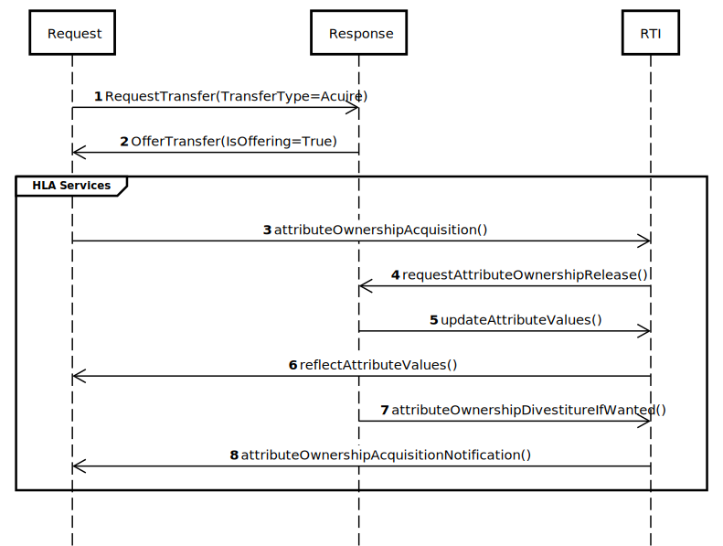
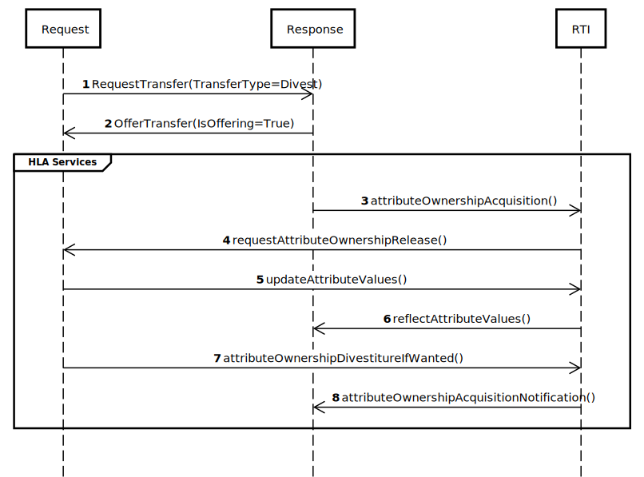
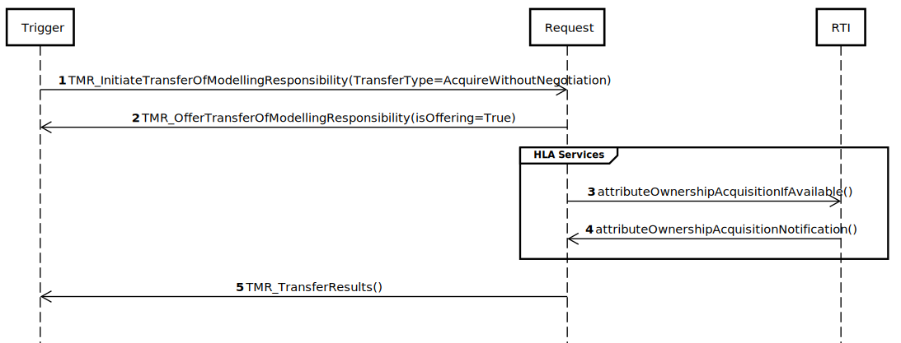
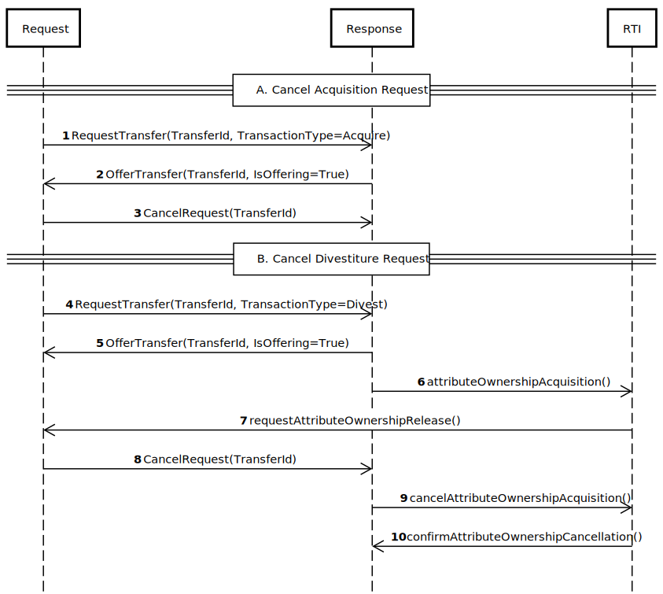

# NETN-TMR

The NATO Education and Training Network (NETN) Transfer of Modelling Responsibilities (TMR) FOM Module.

Copyright (C) 2020 NATO/OTAN.
This work is licensed under a [Creative Commons Attribution-NoDerivatives 4.0 International License](LICENCE.md).

## Introduction

In a federated distributed simulation the participating systems (federates) collectively model the synthetic environment. Allocation of modelling responsibilities are based on individual federate capabilities, federation design agreements, and initial scenario conditions. The responsibility of updating an attribute for a specific simulated entity is allocated to at most one federate. However, during execution, the modelling responsibility may change and the ownership of attributes can be transferred. 

Basic services for the divestiture and acquisition of attribute ownership is provided by IEEE 1516 High Level Architecture (HLA). A negotiated and coordinated transfer of modelling responsibilities requires agreements between federates before attribute ownership is transferred. 

The NATO Education and Training Network Transfer of Modelling Responsibilities (NETN-TMR) FOM Module is a specification of how to perform a negotiated and coordinated transfer of attribute modelling responsibility between federates in a distributed simulation. 

The specification is based on IEEE 1516 High Level Architecture (HLA) Object Model Template (OMT) and primarily intended to support interoperability in a federated simulation (federation) based on HLA. A Federation Object Model (FOM) Module is used to specify how data is represented and exchanged in the federation. The NETN-TMR FOM module is available as an XML file for use in HLA based federations.

### Purpose

The NETN-TMR FOM module provides a standard interface and protocol for conducting negotiated and coordinated transfer of attribute modelling responsibility between federates. It extends the HLA Ownership Management services by providing the means to 
1. Negotiate the transfer of ownership. 
2. Initiate ownership transfer using a Trigger federate.

A transfer of modelling responsibility is performed during runtime, to dynamically change the responsibility to update specific attributes, to a more suitable federate.

For example: 
- Transfer from a Live to a Virtual or Constructive simulation
- Transfer between Virtual and Constructive simulations
- Transfer between hi- and low-fidelity models
- Transfer to allow backup, maintenance or load-balancing
- Transfer of certain attributes to functional models such as movement, damage assessment etc.

### Scope

NETN-TMR covers the following cases:

* Negotiated acquisition where a federate request to receive the modelling responsibility 
* Negotiated divestiture where a federate request another federate to take modelling responsibility
* Acquisition without negotiation where a federate receives the modelling responsibility 
* Cancellation of transfer

## Transfer of Modelling Responsibilities Pattern

NETN-TMR uses a combination of HLA interactions and HLA Owenership Management services to negotiate and perform a coordinated transfer of attribute ownership. The pattern includes an optional triggering interaction to initiate a transfer, and interactions for requesting, offering, cancelling and sending results of a completed transfer.

* A federate initiating a TMR is called a **Trigger Federate**
* The federate requesting a TMR is called the **Request Federate**
* The federate responding to a request for TMR is called the **Response Federate**

### Interaction Classes

**Figure: Interaction Classes**

#### TMR_Interaction

The `TMR_Interaction` interaction class is the base for all Transfer of Modelling Responsibility interactions. It provides a single parameter used in all TMR interactions to uniquely identify TMR transactions between participating federates.

|Parameter|Description|
|---|---|
|EventId|**Required**: The `EventId` is a unique reference to a specific execution of a TMR pattern. It consists of two values, a Counter and a Federate Handle. The value of this parameter is also encoded and used as the User Supplied Tag in the HLA Ownership services to allow a correlation between the TMR interactions and HLA Ownership services. The `EventId` is generated by a trigger federate or, if no trigger federate is used, directly by the requesting federate. The value of this parameter is used to match all related TMR pattern interactions belonging to the same Transfer of Modelling Responsibilities event.|

#### InitiateTransfer

An `InitiateTransfer` interaction is sent by a **Trigger Federate** to initiate a TMR request. Parameters include information on the participating federates, which object instances and what attributes are included in the transfer.  The **Trigger Federate** shall generate a unique `EventId` to be used in all subsequent TMR interactions related to the event.

|Parameter|Description|
|---|---|
|RequestFederate|**Required**: A Federate Name specifying the federate that makes the request for the transfer.
|ResponseFederate|**Required unless TransferType is AquireWithoutNegotiation**: : A Federate Name specifying the federate that is the responding federate.|
|Instances|**Required**: References (UUID) to NETN Platform, Lifeform or Aggregate intances for which modelling responsibility will be transferred.|
|Attributes|**Required**: The common set of attributes for all referenced instances to be included in the transfer. Attributes are referenced by attribute name.|
|TransferType|**Required**: An enumerated value that indicates the direction of the transfer of the ownership and whether there shall be any negotiation: `Acquire` = Requesting Federate acquires instance attribute ownership from the Responding Federate (current owner), `Divest` = Requesting Federate (current owner) releases instance attribute ownership to Responding Federate and `AcquireWithoutNegotiating` = Requesting Federate acquires unowned instance attributes.|

The value of these parameters are copied and used by the requesting federate in a subsequent `RequestTransfer` interaction.

#### RequestTransfer
A `RequestTransfer` interaction is sent by the requesting federate to the responding federate. If the request is the result of a `InitiateTransfer` interaction, the parameters from that interaction shall be copied and used in the request including `EventId`. If the request is not triggered the **Request Federate** shall generate a unique `EventId` to be used in all subsequent TMR interactions related to the event.

|Parameter|Description|
|---|---|
|ResponseFederate|**Required unless TransferType is AquireWithoutNegotiation**: : A Federate Name specifying the federate that is the responding federate.|
|Instances|**Required**: References (UUID) to NETN Platform, Lifeform or Aggregate intances for which modelling responsibility will be transferred.|
|Attributes|**Required**: The common set of attributes for all referenced instances to be included in the transfer. Attributes are referenced by attribute name.|
|TransferType|**Required**: An enumerated value that indicates the direction of the transfer of the ownership and whether there shall be any negotiation: `Acquire` = Requesting Federate acquires instance attribute ownership from the Responding Federate (current owner), `Divest` = Requesting Federate (current owner) releases instance attribute ownership to Responding Federate and `AcquireWithoutNegotiating` = Requesting Federate acquires unowned instance attributes.|

#### OfferTransfer
An `OfferTransfer` interaction is sent by a **Response Federate** as a reply to a `RequestTransfer` to indicate if a transfer can be accomplished or not.

**Special Case**:
When the transfer type is Divesting, the delivery order of the interaction `OfferTransfer` and the HLA ownership callback service `requestAttributeOwnershipRelease` at the receiving federate is not determined. Due to this, receiving a `requestAttributeOwnershipRelease` callback should be treated in the same way as receiving a `OfferTransfer` with a positive offer. The user-supplied tag in the callback contains the `EventId` which identifies a specific transfer process.

|Parameter|Description|
|---|---|
|IsOffering|**Required**: True if and only if for all instances all attributes in the request are offered. False if for any instance any attribute in the request is not offered.|
|Reason|**Optional**: An enumerated value that shall specify the reason for a negative offer: `Other`, `CapabilityDoesNotMatch`, `AttributeSetTooRestricted`, `AttributeSetTooExtensive`, `FederateTooBusy`, `AttributeSetNotCompatibleWithPublication`, `OwnershipStateNotApplicableWithRequest`, `EntityNotKnown`. Default value = `Other`.|

#### CancelRequest
A `CancelRequest` interaction can be sent by the **Request Federate** to cancel a request.

|Parameter|Description|
|---|---|
|Reason|**Optional**: An enumerated value that describes the reason for the cancellation: `Other` = When a Requesting Federate for some reason except time out decides not to complete a transfer. `TimeOut` =	When a model's time limit for receiving a TMR offer has passed.|

#### TransferResult
A `TransferResult` interaction is sent by the **Request Federate** to indicate successful or unsuccessful completion of the transfer.

|Parameter|Description|
|---|---|
|IsCompleted|**Required**: A Boolean value indicating the result of the transfer. TRUE = Transfer Completed Successfully.|

### HLA Ownership Management Services

The HLA Ownership Management services used in TMR (callbacks marked with †) are:

* Attribute Ownership Acquisition (when negotiation)
* Attribute Ownership Acquisition If Available (without negotiation)
* Attribute Ownership Divesture If Wanted
* Cancel Attribute Ownership Acquisition
* Request Attribute Ownership Release †
* Attribute Ownership Acquisition Notification †
* Confirm Attribute Ownership Acquisition Cancellation †
* Attribute OwnershipUnavailable †

### TMR Basic Pattern

<!---
participant Trigger
participant Request
participant Response

autonumber 
opt if initiated by trigger
Trigger ->> Request:InitiateTransfer(TransferId)
end

opt TransactionType = Acquire or Divest
Request ->> Response:RequestTransfer(TransferId)

Response->>Request:OfferTransfer(TransferId)

end

group HLA Services
abox over Request, Response:HLA Object and Ownership Management Services\n(UserSuppliedTag = TransferId)
end

opt if initiated by trigger
Trigger <<- Request:TransferResults(TransferId)
end

autonumber off
--->

**Figure: Basic TMR Pattern**

1. To initiate a TMR request, a `InitiateTransfer` is sent by a **Trigger Federate** to a **Request Federate** intended to issue a TMR request. Included in the parameters are the type of the transfer, and detail regarding attributes involved in the transfer. This step is optional.
3. The **Request Federate** federate sends a `RequestTransfer` interaction. Parameters can be copied from a `InitiateTransfer` interaction or generated by the **Request Federate**. Included in the parameters are the type of the transfer, and details regarding attributes involved in the transfer. Three types of transfer can be requested `Acquire`, `Divest` or `AcquireWithoutNegotiating`. The **Request Federate** specifies the transfer type in the `TransferType` parameter.
4. A **Response Federate** replies to the transfer request and makes an offer by sending a `OfferTransfer` interaction. Based on the offer the **Request Federate** can choose to start the transfer using HLA Ownership service.
    - Before divesting instance attributes, the attributes shall be updated (HLA service Update Attribute Values)
    - After the acquisition of instance attributes, the attributes shall be updated (HLA service Update Attribute Values).
    - A Transaction ID is encoded and used as the User Supplied Tag in the HLA Ownership services.
5. The end result of the transfer is sent by the **Request Federate** using a `TransferResults` interaction.

## Use Cases

### Negotiated acquisition
 
The requesting federate initiates the transfer to acquire instance attributes. The transfer is completed successfully.

<!---
participant Request
participant Response
participant RTI

autonumber 

Request ->> Response:RequestTransfer(TransferType=Acuire)

Response->>Request:OfferTransfer(IsOffering=True)

group HLA Services

Request->>RTI: attributeOwnershipAcquisition()
RTI->>Response: requestAttributeOwnershipRelease()
Response->>RTI: updateAttributeValues()
RTI->>Request: reflectAttributeValues()
Response->>RTI: attributeOwnershipDivestitureIfWanted()
RTI->>Request: attributeOwnershipAcquisitionNotification()
end
autonumber off
--->
**Figure: Negotiated Acquisition**

1. The **Request Federate** sends a `RequestTransfer` interaction to the **Response Federate**. The `TransferType` parameter is set to `Acquire` to indicate that attribute ownership is requested to change from the **Response Federate** to the **Request Federate**. Included in the request are references to all instances and associated attributes involved in the transfer.
2. The **Response Federate** replies to the request by sending a  `OfferTransfer` interaction. If the `IsOffering` parameter is True, the **Response Federate** is offering to release ownership of the attributes.
3. The **Request Federate** starts the attribute ownership transfer using HLA Ownership Services by calling the RTI service `attributeOwnershipAcquisition`.
4. The **Response Federate** receives a `requestAttributeOwnershipRelease` callback from the RTI.
5. Before releasing attribute ownership, the **Response Federate** sends a final `updateAttributeValues` for all attributes involved in the transfer.
6. The attribute update is reflected to the **Request Federate** by the RTI using the `reflectAttributeValues` callback.
7. The **Response Federate** divests its ownership of the attributes by calling the RTI service `attributeOwnershipDivestitureIfWanted`.
8. The RTI informs the **Request Federate** and the **Response federate** of the changed ownership using the `attributeOwnershipAcquisitionNotiication` callback.

### Negotiated Divestiture 
The requesting federate initiates the transfer for divesting instance attributes.
 

<!---
participant Request
participant Response
participant RTI

autonumber 

Request ->> Response:RequestTransfer(TransferType=Divest)

Response->>Request:OfferTransfer(IsOffering=True)

group HLA Services

Response->>RTI: attributeOwnershipAcquisition()
RTI->>Request: requestAttributeOwnershipRelease()
Request->>RTI: updateAttributeValues()
RTI->>Response: reflectAttributeValues()
Request->>RTI: attributeOwnershipDivestitureIfWanted()
RTI->>Response: attributeOwnershipAcquisitionNotification()
end
autonumber off

--->

**Figure: Negotiated Divestiture**

1. The **Request Federate** sends a `RequestTransfer` interaction to the **Response Federate**. The `TransferType` parameter is set to `Divest` to indicate that attribute ownership is intended to change from the **Request Federate** to the **Response Federate**. Included in the request are references to all instances and associated attributes involved in the transfer.
2. The **Response Federate** replies to the request by sending a  `OfferTransfer` interaction. If the `IsOffering` parameter is True, the **Response Federate** is offering to acquire ownership of the attributes.
3. The **Response Federate** starts the attribute ownership transfer using HLA Ownership Services by calling the RTI service `attributeOwnershipAcquisition`.
4. The **Request Federate** receives a `requestAttributeOwnershipRelease` callback from the RTI.
5. Before releasing attribute ownership, the **Request Federate** sends a final `updateAttributeValues` for all attributes involved in the transfer.
6. The attribute update is reflected to the **Response Federate** by the RTI using the `reflectAttributeValues` callback.
7. The **Request Federate** divest its ownership of the attributes by calling the RTI service `attributeOwnershipDivestitureIfWanted`.
8. The RTI informs the **Response Federate** (and the Request federate) of the changed ownership using the `attributeOwnershipAcquisitionNotiication` callback.

In the above example, the HLA callback `requestAttributeOwnershipRelease`, with a TransferId as UserSuppliedTag, may be delivered to the **Request Federate** before the `OfferTransfer` is received. In such circumstances, the `requestAttributeOwnershipRelease` is considered a positive offer and the **Request Federate** shall ignore any `OfferTransfer` received later for the same TransferId. 

### Acquisition without Negotiation

<!---
participant Trigger
participant Request
participant RTI

autonumber 

Trigger->>Request: InitiateTransfer(TransferType=AcquireWithoutNegotiation)

group HLA Services

Request->>RTI: attributeOwnershipAcquisitionIfAvailable()
RTI->>Request: attributeOwnershipAcquisitionNotification()
end

Request->>Trigger:TransferResults()
autonumber off

--->
 
**Figure: Acquisition without Negotiation**

1. A `InitiateTransfer` with `TransferType` set to `AcquireWithoutNegotiation` is sent from an **Trigger Federate** to the **Request Federate**.
2. The **Request Federate** uses the HLA Ownership Management Service `attributeOwnershipAcquisitionIfAvailable` to request ownership of attributes without negotiation of its release. 
3. The HLA Ownership Management Service `attributeOwnershipAcquisitionNotification` informs the **Request Federate** when transfer of ownership is completed.
4. The **Request Federate** informs the **Trigger Federate** of the result of the transfer by sending a `TransferResults` interaction.

### Cancellation of Transfer

<!---
participant Request
participant Response
participant RTI

autonumber 

== A. Cancel Acquisition Request==
Request ->> Response:RequestTransfer(TransferId, TransactionType=Acquire)
Response->>Request:OfferTransfer(TransferId, IsOffering=True)
Request ->> Response:CancelRequest(TransferId)

== B. Cancel Divestiture Request==
Request ->> Response:RequestTransfer(TransferId, TransactionType=Divest)
Response->>Request:OfferTransfer(TransferId, IsOffering=True)
Response ->> RTI: attributeOwnershipAcquisition()
RTI ->>Request: requestAttributeOwnershipRelease()
Request ->> Response:CancelRequest(TransferId)
Response ->> RTI: cancelAttributeOwnershipAcquisition()
RTI ->>Response: confirmAttributeOwnershipCancellation()

autonumber off
--->
**Figure: Cancellation of Transfer**

#### A. Cancel Acquisition Request

1. The **Request Federate** initiates an acquisition transfer with a `RequestTransfer` interaction.
2. The **Response Federate** provides a positive offer by sending a `OfferTransfer` interaction.
3. The **Request Federate** sends a `CancelRequest` interaction to cancel the request either after or before receiving the positive offer. No `attributeOwnershipAcquisition` will be sent by the **Request Federate**.

#### B. Cancel Divestiture Request

4. The **Request Federate** initiates a divestiture transfer with a `RequestTransfer` interaction.
5. The **Response Federate** provides a positive offer by sending a `OfferTransfer` interaction.
6. The **Response Federate** immediately sends a `attributeOwnershipAcquisition`
7. The **Request Federate** will receive the `OfferTransfer` interaction and `requestAttributeOwnershipRelease` callback in an undetermined order.
8. The **Request Federate** sends a `CancelRequest` interaction to cancel the request. The cancel is sent any time after making the request but before responding to the `requestAttributeOwnershipRelease` callback.
9. The **Response Federate** calls `cancelAttributeOwnershipAcquisition` to abort the ongoing HLA attribute ownership transfer.
10. The **Response Federate** is notified with a `confirmAttributeOwnershipCancellation` callback when the HLA attribute ownership transfer has been aborted.

